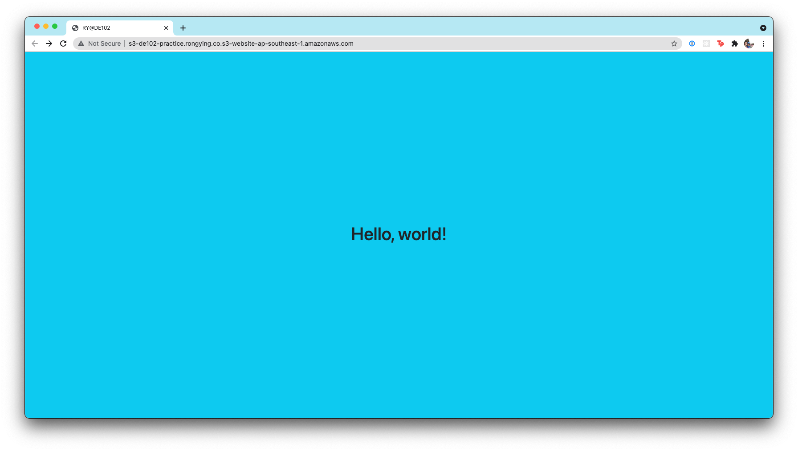

# DE102 Prac

## AWS account
- Use personal account
- Use a specific IAM user for terraform with some IAM policies but not admin

## 1. S3 static website hosting
- Ensure public read 
- Ensure bucket policy (set principal to aws:* and permission is to read)
- Use bootstrapped error/index.html

## 2. Set up Alerting mechanism
- Use bucket notification to push to lambda
- Set up lambda permission to allow s3 to invoke function
- Set up lambda to track bucket changes
- Lambda will invoke SNS to get alerts when hosted site is up
- Configure SNS to send email to admin

:)

